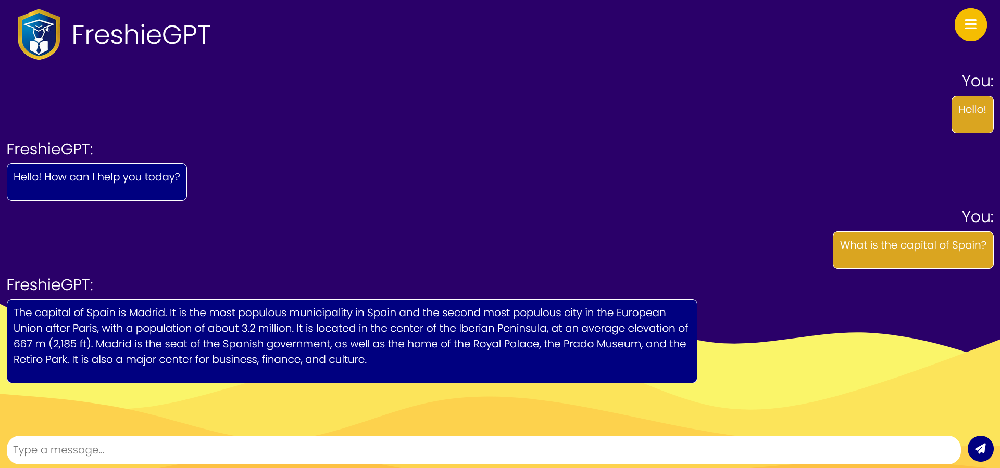
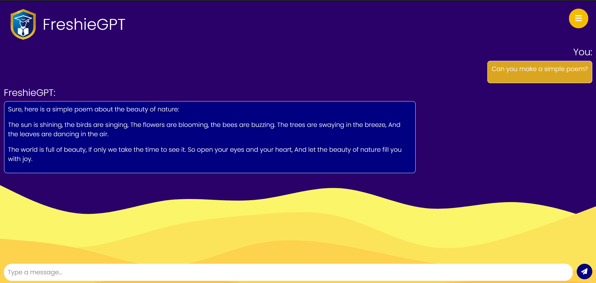

# Feedback GPT App

This is a simple Express.js web application that interacts with Google's PaLM API to generate text based on user prompts. It also allows users to submit feedback.

## Installation

1. Make sure you have [Node.js](https://nodejs.org/) installed on your system.

2. Clone this repository:

    ```
    git clone https://github.com/yourusername/feedback-gpt-app.git
    ```

3. Navigate to the project directory:

    ```
    cd feedback-gpt-app
    ```

4. Install the required dependencies:

    ```
    npm install
    ```

## Running the App

1. Start the server:

    ```
    node app.js
    ```

2. Open your web browser and go to [http://localhost:3000](http://localhost:3000) to access the application.

## Usage

- Enter a prompt in the provided text box and click "Submit" to generate a response from the GPT model.
- Navigate to the "About" and "Services" pages for more information.
- Go to the "Feedback" page to submit your feedback.

## Feedback

We welcome any feedback you have about this application. Feel free to submit your comments through the provided form.

## Dependencies

- [Express.js](https://expressjs.com/)
- [EJS](https://ejs.co/)
- [SQLite3](https://github.com/mapbox/node-sqlite3)

## Google PaLM API

This app uses Google's PaLM API to generate text based on user prompts. Please make sure you have a valid API key to use this service.

## Screenshots




## Note

This is a basic implementation and may require further customization or security measures for production use.
